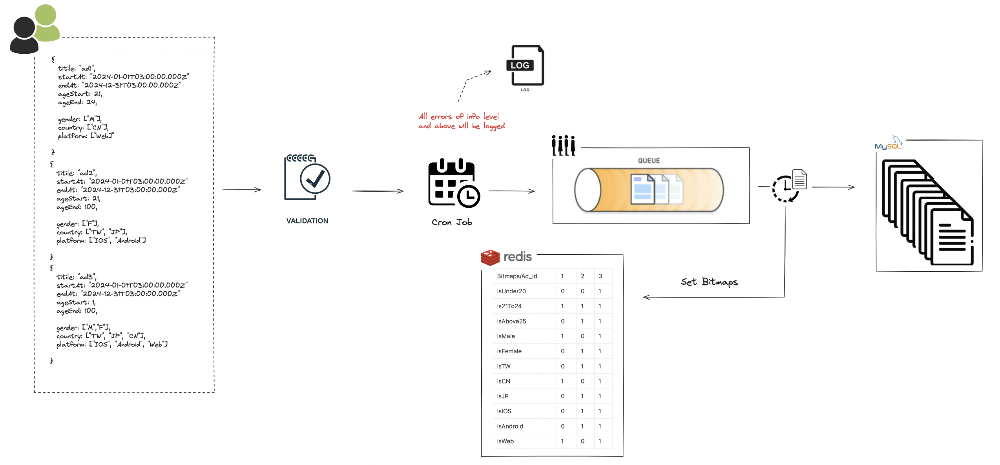
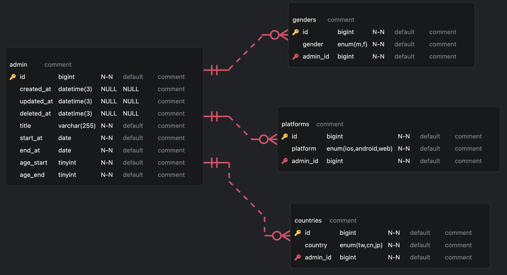
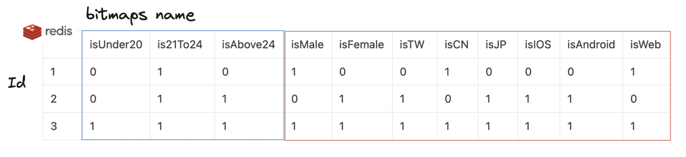
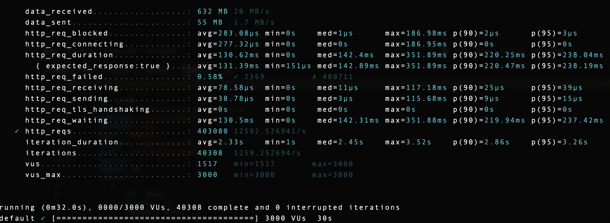
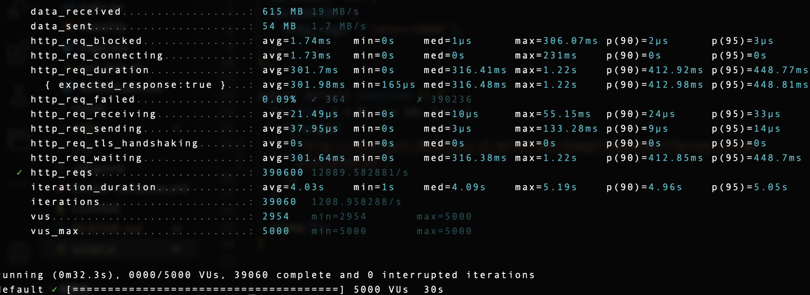
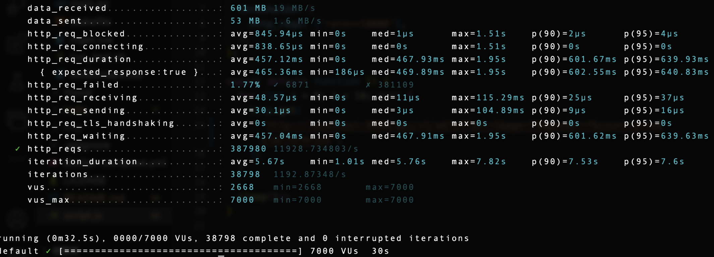

# Dcard-Golang-Project 1.0.0

## Description


## Prerequisite

- Docker (tested with version 25.0.3)
- Docker Compose (tested with version v2.24.6-desktop.1)

## Quick Start

```shell
$ git clone https://github.com/huanciou/dcard-golang-project.git
$ cd ./dcard-golang-project
$ docker-compose up -d
```

## Routes

### Get Advertisements

- URL: http://localhost:8080/api/v1/ad
- Method: GET
- Description: Retrieve advertisements

### POST Advertisements

- URL: http://localhost:8080/api/v1/ad
- Method: POST
- Description: Create a new advertisement

### Generate Mock Data

- URL: http://localhost:8080/api/v1/mock
- Method: GET
- Description: 若不足額將廣告填滿至 3000 則, 反之則不動作

## API

- POST

| Parameter | Type       | Required | Description                      |
| --------- | ---------- | -------- | -------------------------------- |
| title     | string     | Yes      | varchar(255)                     |
| startAt   | time.Time  | Yes      | YYYY-MM-DDT00:00:00Z             |
| endAt     | time.Time  | Yes      | YYYY-MM-DDT00:00:00Z             |
| ageStart  | int        | Yes      | 1, 20, 24                        |
| ageEnd    | int        | Yes      | 20, 24, 100 && ageEnd > ageStart |
| country   | []Country  | Yes      | TW, JP, CN                       |
| gender    | []Gender   | Yes      | M, F                             |
| platform  | []Platform | Yes      | IOS, Android, Web                |

```shell
$ curl -X POST -H "Content-Type: application/json" \
"http://localhost:8080/api/v1/ad" \
--data '{
  "title": "AD1",
  "startAt": "2024-03-01T00:00:00Z",
  "endAt": "2024-03-02T00:00:00Z",
  "ageStart": 1,
  "ageEnd": 100,
  "country": [{ "country": "TW" }, { "country": "JP" }],
  "gender": [{ "gender": "M" }, { "gender": "F" }],
  "platform": [
    { "platform": "android" },
    { "platform": "ios" },
    { "platform": "web" }
  ]
}'
```

- GET

| Parameter | Type   | Required | Description       |
| --------- | ------ | -------- | ----------------- |
| offset    | int    | No       | min=1, max=100    |
| limit     | int    | No       | const             |
| age       | int    | No       | min=1, max=100    |
| gender    | string | No       | M, F              |
| country   | string | No       | TW, JP, CN        |
| platform  | string | No       | IOS, Android, Web |

```shell
$ curl -X GET -H "Content-Type: application/json" \
"http://localhost:8080/api/v1/ad?offset=10&limit=3&age=24&gender=F&country=TW&platform=ios"
```

## Server Features

### Error Handler

將 `errorHandler` 作為 global middleware 置於 routes 之前, 當在 routes 中出現
一些預期之外的 error 時, 製造 `panic`, 此時的 error 會追溯 stack 中最近的 `recovery`
處理問題。於是 `errorHandler` 作為全局的 middleware 便能起到作用。

而我們利用 switch case 將 error 分為幾類：

- `ValidationError`:
  - Status Code: 400 處理用戶驗證錯誤, 回傳給用戶 Validation Error。
- `ServerInternalError`
  - Status Code: 500 處理伺服器端異常錯誤, 回傳給用戶 Server Internal Error。
- `CustomizedError`
  - Status Code: 400 處理特定錯誤, 回傳客製化錯誤給用戶。
- `Error`
  - Status Code: 500 處理非預期的 Runtime Error, 回傳給用戶 Unexpected Error。

### Logger


將 `Logger` 作為 global middleware 置於 rotues 之前, 並且當 `errorHandler` 在獲取
panic 時, 除了回傳給用戶對應的錯誤 status code 以外, 並將`實際錯誤內容`寫入當日的 log 檔之中。
同時將 Logger Level 設定為 `Info` 級別, 紀錄所有 Info 等級以上至日誌當中。

而我們對應不同種類的 Error 給予不同級別的分級, 以下提及本專案實際使用的級別：

- `Info`: 紀錄用戶正常運行狀態
  - 當 GET, POST 廣告輸入 invalid params 時, 紀錄。
- `Warning`
  - 當某些程序未依照期待執行時, 如 db 連線失敗、redis 連接失敗等, 紀錄。
- `Error`
  - 當出現非預期的 Runtime Error 時, 紀錄。

### Validator

預先定義 GET, POST method 傳入的 Struct format。 <br>
當用戶傳入非定義的格式時, 將回傳 Validation Error 給予用戶。

### Cron Job

在每日 00:00 時 `CronJob` 將會進行三件事情：

- 將 Redis 當中的 `post_queue` 推送至 db 當中
- 在將 post 存入 db 後, 清洗掉當前 Redis 當中的快取
- 從 db 當中將 符合日期、尚未刪除仍然活躍的貼文並按照 時序(ASC) 取出 <br>
  並透過 `SetBitmaps` 更新 Redis 快取

## Flow

### POST ADs



用戶新增廣告時，會先經過 Validator 驗證, 若成功將會把貼文送入 Redis 中的 post_queue 中 <br>
待每日 00:00 時, Scheduler 會執行三項動作：

1. 將 post_queue 當中的當日所有廣告推送至資料庫當中
2. 清空 Redis 快取
3. 從資料庫拿出所有符合條件(未標示刪除、已起始、按照結束日期升序)的所有廣告, 建立 [BitMaps](#bitmap) 放入 Redis 當中

### GET ADs


用戶查詢符合條件的廣告時，會先經過 Validator 驗證參數正確性, 若成功會直接前往 Redis 中,
利用 Bitwise 方式找尋對應符合條件的廣告貼文，回傳給用戶

## MySQL



主要使用到的 Query 語句為
用於 [cron job](#cron-job) 中 <br>
尋找所有尚未刪除, 並且在效期內的廣告, 按照結束時間升序 <br>
再置放入 Redis 當中依序建立 [BitMaps](#bitmap)

```go
Where("admin.deleted_at IS NULL").
Where("admin.start_at < ? AND admin.end_at > ?", now, now).
Order("end_at ASC")
```

若之後有更多查詢語句需要執行，可以建立聯合索引，並用 `Explain` 語句查看索引覆蓋範圍

## Redis

本專案在使用 Redis 作為快取, 在 Redis 當中會儲存三種類型的結果最為快取

- 當日符合 StartAt < NOW < EndAt 的所有結果, 以 `key: Id`, `value: 對應廣告` 結構儲存
- 將廣告的多個 Conditions 建立成 `BitMaps`, 並以 0/1 儲存 該廣告 是否符合這項條件
- `post_queue` 採 FIFO 的方式紀錄, 作為當日所有建立的廣告之暫存的一個 List 結構

### Cache Strategy

這個專案要怎麼做好快取在一開始一直沒有個好的辦法, 原因是這個廣告投放會有以下幾個特點

1. 用戶會隨時需要依照不同條件領取符合的廣告
2. 買廣告的人可能會高頻率的更新廣告

- 最一開始我先想到的辦法是, 將 URL 做 Hash 存入 Redis 當中作為 Key <br>
  當用戶觸發 GET 方法, 並帶著條件時, 先在 query DB 後, 存入 Redis <br>
  利用 key-value 的方式, key 為 hash 過後的 URL, Value 為 DB 搜尋後的所有廣告結果 <br>

然後這樣做雖然看似可行, 但是需要考慮以下因素

- 當存入一則新廣告時, 快取中的舊廣告就很有可能同時需要更動：
  因此當一則新廣告插入 db 後, 我需要更新 redis 中所有符合這則廣告條件的 key
  在快取越來越多的情況下, 這種方法需要耗損太高的成本
- 因為條件有多種, 如果一種條件就存成一個 key, 那我會需要很大的空間來儲存不同的 key 對應的廣告

  ```
  age=24&gender=F&country=TW&platform=ios: { 廣告1, 廣告3, 廣告5 ...}
  age=25&gender=F&country=TW&platform=ios: { 廣告1, 廣告3, 廣告5 ...}
  ```

  於是會發現很有可能發生, key 不同, 但是其實存的結果是相同的情況發生 <br>
  由上述的判斷, 則可以大致發現這樣的快取策略在廣告量越來越大的情況下不是很現實。

因此在重新審視這個廣告實際所需要做到的業務邏輯後, 使用了另一種方式做為快取策略：

- 當加入新廣告後：我的想法是這則廣告不需要馬上存入到資料庫當中。反而是在 Redis 中建立
  一個 `post_queue`, 在判斷新廣告符合格式, 以及根據題幹每日新增的廣告不得 > 3000 筆後,
  將廣告依照 FIFO 的方式存入 queue 當中。

- Cron Job：需要有一個每日執行的任務, 在每日 00:00 時(可依照業務邏輯決定更新週期),
  會有一個定時任務將 `post_queue` 當中的廣告依照順序加入資料庫當中, 同時也會在資料庫中搜尋一次符合 StartAt < NOW < EndAt , 並且未標示為刪除的廣告, 一次依序(ASC)拿出, 這時候拿出的的所有廣告我可以確保是符合今日條件, 並且已經按照順序排序的, 這時候我需要對這些符合條件的廣告建立 BitMaps 存入 Redis 當中。

- 當用戶依照條件拿廣告：在建立好今日的 [Bitmap](#bitmap) 後, 每次用戶需要找到符合的廣告條件時, 我不需要對資料庫進行 query, 我只需要在 Redis 中對用戶搜尋廣告的條件做 [Bitwise](#bitmap) 的 AND, OR 操作就可以高效率的找到符合的對應廣告。

因此在整個設計上, 一天只需要 I/O DB 兩次, 一次是整筆廣告存入, 一次是符合當日條件的廣告取出。

### BitMap

假定今日有三篇需要儲存的廣告, 規格如下：

```json
{
  "titile": "ad1",
  "startAt": "2024-01-01T03:00:00.000Z",
  "endAt": "2024-12-29T03:00:00.000Z",
  "ageStart": 21,
  "ageEnd": 24,
  "gender": ["M"],
  "country": ["CN"],
  "platform": ["Web"]
}
{
  "titile": "ad2",
  "startAt": "2024-01-01T03:00:00.000Z",
  "endAt": "2024-12-30T03:00:00.000Z",
  "ageStart": 21,
  "ageEnd": 100,
  "gender": ["F"],
  "country": ["TW", "JP"],
  "platform": ["IOS", "Android"]
}
{
  "titile": "ad3",
  "startAt": "2024-01-01T03:00:00.000Z",
  "endAt": "2024-12-31T03:00:00.000Z",
  "ageStart": 1,
  "ageEnd": 100,
  "gender": ["M", "F"],
  "country": ["TW", "JP", "CN"],
  "platform": ["IOS", "Android","Web"]
}
```

我需要依照這些已經存在的條件建立 BitMaps, 而在 Redis 中建立 BitMap 的方式為

```
SETBIT <bitmap name> <id> <1/0>
```

因為每一個 Index 只會有 1/0 代表著 true/false, 因此一位只佔 1 bit 的空間
整體佔用儲存空間非常小



接著當 Get Method 觸發：

```
api/v1/ad?offset=10&limit=3&age=24&gender=F&country=TW&platform=ios
```

我們只需要對已經存在的 BitMap name 做 Bitwise 的運算

```go
BITOP OR age is21To24 isAbove24 // id:1, id:2, id:3
BITOP AND conditions isFemale isTW isIOS // id:2, id:3
BITOP AND age conditions // id:2, id:3
```

我們就可以得到一個含有所有結果的 binary string: 0011 <br>
因此我們再轉換並放入 []string: [2,3] <br>
再拿 [2,3] 利用 key-value pair 到 Redis 找對應的值, 得到回傳的資訊 <br>
並且因為當初我們在建立 BitMaps 時, 就已經按照時序來排過順序, 因此 id 靠前的廣告 <br>
必定是越快過期的, 我們只要將結果拼起來回傳便可以完成 <br>

再者, 因為是用陣列來儲存的特性, Index 是有序的 <br>
我們可以避免碰如在 RDBMS 中因為利用 B+ Tree 儲存的特性 <br>
使用 Offset&Limit 語法需要獲取指定範圍內的值時, 仍然需要從頭去遍歷符合條件的結果的問題 <br>
而這個問題在遇到儲存龐大廣告時, 可能需要使用 cursor-based pagination 來對分頁做優化 <br>

## Lua

為什麼會使用到 Lua Script ?

1. 保持原子性。 Lua 將整個腳本視為一個整體來操作, 能將多個 GET 視為一個操作,
   當其一在操作中失敗, 將會 rollback, 避免只有單一動作完成, 另一失敗的問題

2. 減少 Redis IO. 如果使用 go-redis 直接操作 Redis, 多次的 query 會造成多次
   IO Redis 進而造成多餘的網路開銷, 使用 Lua 將整個事務視為一體可減少 Redis 負載

<br>
在服務器啟動時, 會預先透過 "LoadLuaScript" 將 Lua Script 預加載至 Redis 上, 並產生一個 SHA-1 的 Hash。當下一次需要用到這個腳本時, 服務器端只要提供對應的 Hash, Redis 就可以根據
key-value pair 來得到這個儲存的腳本, 以此減少重新解析腳本的動作。

## Docker


本專案使用 docker-compose 將三個 Images 包起, 分別為 web, db, redis <br>
因此在開啟服務器只需要在 `dcard-golang-project` 路徑中 `docker-compose up -d` <br>
將依照 yml 檔的設定把容器啟動, 自行運行服務器, 節省設定環境的步驟

## CI/CD Flow


## Test Running

[Start Docker Compose First](#quick-start)

```shell
$ docker-compose exec -T web ./run_test.sh
```

## Performance Testing

### Test Environment

All performance tests were conducted on the same machine with the following specifications:

- Machine Type: MacBook Air (M1, 2020)
- CPU: Apple M1 Chip
- Memory: 8 GB RAM
- Operating System: MacOS Monterey 12.4

### Test Result

- 3000 VUs, 10 iterations per VU
  
- 5000 VUs, 10 iterations per VU
  
- 7000 VUs, 10 iterations per VU
  
